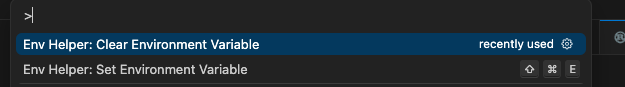

# Environment Variables Helper

A VSCode/Cursor extension for securely setting environment variables for development and testing without leaving filesystem traces.

The extension adds to the command palette (`CtrlOrCmd+Shift+P`) two new commands:



The video below shows how the extension can help with the rust test runner:


## Features

- 🔒 **Secure**: Environment variables stored in memory only - no filesystem traces
- 🌐 **Universal**: Works with any programming language and framework
- 🔄 **Auto-reload**: Automatically restarts language servers when variables are set (Rust, TypeScript, Python, C++)
- 🧪 **Test integration**: Run tests with custom environment variables
- 🎨 **User-friendly**: Password-masked input for sensitive values

## Commands

- **Set Environment Variable** (`Ctrl+Shift+E` / `Cmd+Shift+E`): Set a new environment variable
- **Clear Environment Variable**: Remove a previously set variable
- **List Set Variables**: Show currently set variable names (values hidden for security)
- **Run Test with Environment**: Run a specific test with current environment variables

## Usage

1. **Set an environment variable**:
   - Press `Ctrl+Shift+E` (or `Cmd+Shift+E` on Mac)
   - Or use Command Palette (`Ctrl+Shift+P`) → "Env Helper: Set Environment Variable"
   - Enter variable name (e.g., `API_KEY`, `DATABASE_URL`)
   - Enter value (input will be masked for security)

2. **Run your test**:
   - Use "Env Helper: Run Test with Environment" command
   - Or use the regular "Run test" button (environment variables are inherited)

3. **Clear variables when done**:
   - Use "Env Helper: Clear Environment Variable" command
   - Or restart VSCode/Cursor to clear all variables

## Security Features

- Environment variables are stored only in memory
- No configuration files are modified
- Sensitive values are masked during input
- Variables are automatically cleared when extension is deactivated
- No traces left in filesystem or version control

## Supported Languages

### Language Server Auto-Restart

- **Rust** - `rust-analyzer`
- **TypeScript/JavaScript** - TypeScript language server
- **Python** - Python language server
- **C/C++** - Microsoft C/C++, clangd, ccls

### Test Pattern Detection

- **Rust** - `#[test]` annotations
- **JavaScript/TypeScript** - `test()`, `it()`, `describe()`
- **Python** - `def test_*()` functions
- **C++** - Google Test (`TEST`, `TEST_F`), Catch2 (`TEST_CASE`, `SCENARIO`)

## Perfect for

- Setting API keys and tokens for tests
- Database connection strings
- Feature flags
- Compiler flags and build configurations
- Any sensitive configuration that shouldn't be in files

## Development mode

1. Open the extension folder in VSCode/Cursor
2. Press `F5` to run in development mode
3. Or package and install:

   ```
   npm install
   npm build
   npm run package
   cursor --install-extension environment-variables-helper-0.0.1.vsix
   ```